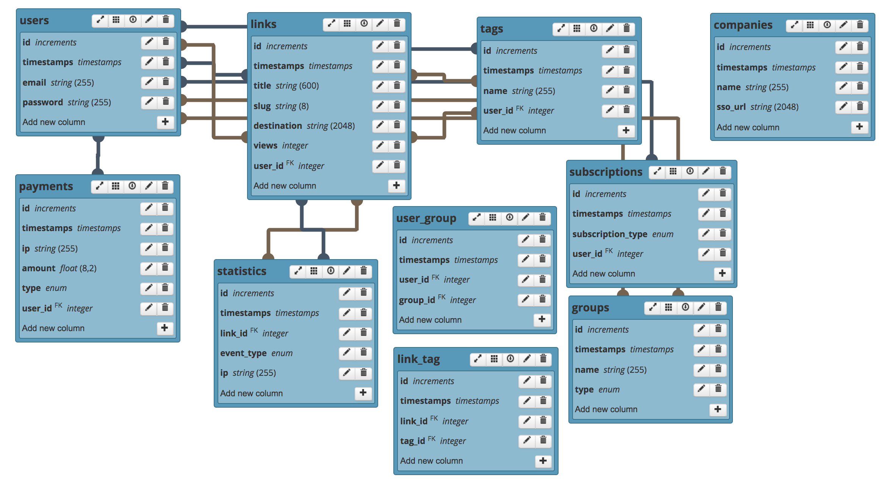

# Linkly (link shortening service)

The working application is deployed at https://links.maxoffsky.com. Feel free to register!

This is a small application that satisfies the requirements of the challenge:

"Create a web application that takes a URL as an input and generates a “short­url” for it (similar
to bitly.com). Output URL should be short, readable and able to be easily copy­pasted by users."

Constraints:
1. URL parameters should be considered part of the URL uniqueness test.
2. A generated short URL should expire if not accessed for 14 or more days
3. Treat this as a real software; eg: persist data in an actual data store, handle error cases
etc

## Stack

The Application uses the following stack:

- PHP, Laravel framework
- Javascript
- MySQL for database
- Bootstrap with customizations for UI

## Code

The main parts of the application are in the following files:

1) Home Page view and Link controller: https://github.com/msurguy/linkly/blob/master/resources/views/index.blade.php,  https://github.com/msurguy/linkly/blob/master/app/Http/Controllers/LinkController.php
2) Javascript for copying the links: https://github.com/msurguy/linkly/blob/master/resources/js/app.js

3) SASS customizations: https://github.com/msurguy/linkly/blob/master/resources/sass/app.scss

4) User Dashboard for logged in users: https://github.com/msurguy/linkly/blob/master/resources/views/dashboard.blade.php

5) Scheduler for cleanup tasks: https://github.com/msurguy/linkly/blob/master/app/Console/Commands/CleanLinks.php

Next I will describe how I worked during this challenge:

## Process

I approached the product in the following three steps:

1) Define stakeholders
2) Create a feature map of what stakeholders would want
3) Develop the solution using MVP features from the full set

Here I will explain the steps in more detail:

### Defining Stakeholders 

First, I defined the stakeholders of the application and outlined them in this diagram:

### Complete list of features

Complete set of features that an application would have:

New User:
* Insert or paste a URL
* Retrieve a shortened unique URL
* Copy the URL into clipboard
* Share the URL via social networks / email
* See an option to upgrade account

Experienced User:

in addition to the New User functionality:
* Register and Login
* Logout
* See a list of all links I created
* See number of times the links have been clicked by others
* Be able to customize the link / s with a new name that is unique throughout the platform
* Set notification threshold and methods (email, SMS, messenger, etc)
* See an option to upgrade account to business
* Delete account

Business:
* Set custom domain and receive instructions on set up
* See a dashboard of all links shared by the business users
* Create groups of users (marketing, business, HR, etc)
* Be able to tag shortened links with tags unique to the business

Data aggregators:
* Receive batches of data every N minutes

Product / Management:
* See what categories of links are being shared the most
* Check numbers of users / links shared

Product / Technology:
* See status of all systems / APIs
* Check logs of errors / access violations / permissions / etc
* Dig deep into timing of various events 

Product / Research:
* Collect surveys and other user feedback

Product / Business:
* See revenue reports
* See top sharers

### Developing the solution

I thought about the problem from multiple angles when developing this solution. For example, here are the assumptions that I made during the process:

- Each created link would have a new hash, for the sake of tracking the unique links (though in lines 22-30 of `LinkController.php` I explain that we can retrieve hash of existing link and return that instead)
- There would be 7 characters in each link, consisting of letters A-Z, a-z and numbers 0-9, giving 62 to 7th power of possible links
- The links would be encoded using battle-tested https://hashids.org PHP library, minimizing the chance of curse words appearing in the URL
- Users could register on the system to get more value out of the platform
- Users that are logged in would have a dashboard and be able to see their links and stats about those links
- The links would be tracked each time they are accessed (increasing the view counter in the DB)
- For cleaning up expired links with 0 views, I created a cron job that runs every hour and finds entries in DB that satisfy the conditions
- I didn't pursue scaling for this exercise because I was shooting for a solution that has a balance of design, engineering and business. I left comments in the code about optimizations and could talk aout  scaling options in person. 

Database:

Here is the DB structure of the application:

To better understand how a link shortener works, I have done some research into how Bitly operates. For example, they use 301 redirect but for testing purposes I used 302 redirect so that I can see the view count increase when accessing links from the same browser.  

From Bitly's FAQ:
"When you shorten a link with Bitly, you are redirecting a click from Bitly to the destination URL. We issue a "301 redirect": a technique for making a webpage available under many URLs. A 301 redirect is the most efficient and search engine-friendly method for webpage redirection. Because Bitly doesn’t re-use or modify links, we consider our redirects to be permanent."